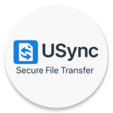

<div align="center">



# 📱 FileTransferApp

### A feature-rich Android app to wirelessly transfer files, browse the filesystem, and control a Raspberry Pi from your phone.

[](https://developer.android.com)
[](https://kotlinlang.org)
[](https://www.jcraft.com/jsch/)
[](LICENSE)
[](https://developer.android.com/studio/releases/platforms)

</div>

---

## 📖 Table of Contents

- [About the Project](#-about-the-project)
- [Features](#-features)
- [Screenshots](#-screenshots)
- [Architecture](#-architecture)
- [Tech Stack](#-tech-stack)
- [Project Structure](#-project-structure)
- [Prerequisites](#-prerequisites)
- [Getting Started](#-getting-started)
  - [Raspberry Pi Setup](#raspberry-pi-setup)
  - [Android App Setup](#android-app-setup)
  - [Connecting for the First Time](#connecting-for-the-first-time)
- [How It Works](#-how-it-works)
- [Permissions](#-permissions)
- [Configuration & Credentials](#-configuration--credentials)
- [Known Limitations](#-known-limitations)
- [Contributing](#-contributing)
- [License](#-license)

---

## 🔍 About the Project

**FileTransferApp** is a native Android application built in **Kotlin** that turns your Android smartphone into a powerful remote file management tool for your **Raspberry Pi**. No USB cables, no `scp` commands — just a clean mobile UI that:

- Connects to the Pi over **SSH/SFTP** on your local Wi-Fi
- Lets you **send files from phone → Pi** and **receive files from Pi → phone**
- Provides a full **remote file browser** (browse, open, rename, delete, move, download)
- Provides a **local file browser** for files already downloaded to the phone
- Lets you **preview images, play audio, read PDFs and documents** without leaving the app
- Includes a **Bluetooth keyboard** to send commands to the Pi via serial (RFCOMM)
- **Auto-discovers** the Pi on your network or by Wi-Fi hotspot scan
- Stores credentials **securely** using Android's `EncryptedSharedPreferences`

> 💡 **Primary Use Case:** A Raspberry Pi sits on your desk connected to a hotspot/home router. You use this app from your Android phone to quickly push files to it, pull files from it, manage its filesystem, and even type commands to it — all wirelessly.

---

## ✨ Features

### 🔌 Connection Management
- SSH connect to Pi using IP, username & password
- **Auto-reconnect** if session drops (no manual reconnect needed)
- **Wi-Fi scan** — detects Pi hotspot networks (filters by "pi", "rasp", "ap", "berry")
- **Subnet scan** — probes port 22 on all IPs (e.g. 192.168.x.1–254) to find the Pi automatically
- **Known Devices** list — shows previously connected Pis for one-tap reconnect
- SSH **keepalive** every 15 seconds to maintain persistent sessions
- Live connection status indicator (green/red) on every screen

### 📤 Send Files (Phone → Pi)
- Pick **multiple files** from phone storage using the system file picker
- Upload all files sequentially to `/home/<user>/incoming/` on the Pi
- **Real-time progress bar** per file and per batch
- Shows file name, current file index, and percentage

### 📥 Receive Files (Pi → Phone)
- Lists all files in Pi's `incoming/` directory
- Downloads all files with per-file **progress tracking**
- **Auto-categorizes** downloads by type:
  - 📸 Images → `URead/Pictures/`
  - 🎵 Audio → `URead/Audio/`
  - 🎬 Videos → `URead/Videos/`
  - 📄 Documents → `URead/Documents/`
  - 📦 Others → `URead/Others/`

### 📁 Remote File Browser
- Browse **any directory** on the Pi starting from `/home/<user>`
- Navigate into folders and back
- **Search** files by name (live filter as you type)
- **Sort** by Name, Type, or Size
- **Long-press multi-select** for batch operations
- Context action bar operations:
  - ⬇️ Download to phone
  - 🗑️ Delete file/folder
  - ✏️ Rename
  - 📂 Move to another folder
  - ➕ Create new folder
- Tap any file to **open in built-in viewer**

### 📂 Local File Browser
- Browse the `URead/` folder on your phone
- Same search, sort, multi-select, and action bar features
- **Delete**, **rename**, **move** files locally
- Open in built-in viewers

### 🖼️ In-App File Viewers
| Viewer | Formats |
|--------|---------|
| **Image Viewer** | jpg, jpeg, png, gif, bmp, webp |
| **Audio Player** | mp3, wav, aac, ogg, m4a |
| **PDF Viewer** | pdf (page-by-page navigation) |
| **Text Preview** | txt, doc, docx, rtf |

### ⌨️ Bluetooth Keyboard
- Connect to Pi over **Bluetooth RFCOMM (Serial Port Profile)**
- 10 on-screen buttons sending characters 0–9 and A–J
- **Smart double-tap**: single tap = digit, double-tap within 250ms = letter
- Auto-saves last connected device for instant reconnect
- Scan filtered to Pi-named Bluetooth devices
- Haptic **vibration** + **beep** feedback on every keypress

### 🎵 UI Polish
- Unique **click sounds** for each main-screen button (7 custom MP3s)
- Status bar colors: green = connected, red = disconnected
- Buttons automatically **dim when offline** (Send, Receive, Files require connection)

---

## 📸 Screenshots

> *(Add your screenshots here)*

| Home Screen | Setup / Connect | Send Files |
|:-----------:|:---------------:|:----------:|
| *Coming soon* | *Coming soon* | *Coming soon* |

| Remote Files | Keyboard | Audio Player |
|:------------:|:--------:|:------------:|
| *Coming soon* | *Coming soon* | *Coming soon* |

---

## 🏗️ Architecture

```
┌──────────────────────────────────────────────────────────────┐
│                     Android Phone (UI)                       │
│                                                              │
│  MainActivity ──→ setup ──→ SessionManager.connect()         │
│       │                                                      │
│       ├──→ Send1          (Upload files)                     │
│       ├──→ Receive        (Download files)                   │
│       ├──→ FilesActivity  (Remote file browser)              │
│       ├──→ LocalFilesActivity (Phone file browser)           │
│       └──→ Keyboard       (BT keyboard)                      │
│                                                              │
│  Viewers:  ImageViewerActivity  │ AudioPlayerActivity        │
│            PdfViewerActivity    │ FilePreviewActivity        │
└──────────────────┬───────────────────────────────────────────┘
                   │
     ┌─────────────▼─────────────┐
     │      SessionManager       │  ◄── Kotlin singleton object
     │  (SSH Session + SFTP)     │
     │  • connect / reconnect    │
     │  • runCommand             │
     │  • listDirectory          │
     │  • uploadFile / download  │
     │  • delete / rename / move │
     └─────────────┬─────────────┘
                   │  JSch library — SSH/SFTP protocol
                   │  TCP port 22 over Wi-Fi
                   ▼
     ┌─────────────────────────────┐
     │        Raspberry Pi         │
     │                             │
     │  /home/<user>/incoming/     │  ◄── Upload/download target
     │  + any directory via SFTP   │
     └─────────────────────────────┘

Bluetooth (Keyboard feature):
     Android ──[RFCOMM SPP UUID]──► Pi Bluetooth serial
```

### Design Patterns Used
| Pattern | Where |
|---------|-------|
| **Singleton** | `SessionManager` — single SSH session across the whole app |
| **Listener/Callback** | `FileAdapter.Listener`, `PickerAdapter.Listener` |
| **Activity Result API** | File picker (`GetMultipleContents`), permissions |
| **Background Thread + runOnUiThread** | All SSH/SFTP/BT work off UI thread |
| **Broadcast Receiver** | Wi-Fi state changes, Bluetooth device discovery |
| **ActionMode** | Contextual multi-select toolbar in file browsers |

---

## 🛠️ Tech Stack

| Technology | Version | Role |
|-----------|---------|------|
| **Kotlin** | 1.8.0 | Primary language |
| **Android SDK** | API 29–34 | Platform (Android 10–14) |
| **JSch** | 0.1.55 | SSH/SFTP protocol implementation |
| **Glide** | 4.16.0 | Image loading & caching |
| **PhotoView** | 2.3.0 | Pinch-to-zoom image view |
| **EncryptedSharedPreferences** | 1.1.0-alpha06 | Encrypted credential storage |
| **Google Play Services Nearby** | 19.3.0 | Nearby device APIs |
| **Multidex** | 2.0.1 | Supports large method count |
| **ViewPager2** | 1.0.0 | Page-swipe views |
| **Kotlin Coroutines** | 1.7.3 | Async/concurrency support |
| **Android PdfRenderer** | Built-in | PDF page-to-bitmap rendering |
| **Android MediaPlayer** | Built-in | Audio playback |
| **Android Bluetooth API** | Built-in | RFCOMM/SPP serial socket |
| **Android WifiManager** | Built-in | Wi-Fi scan & connection info |
| **ViewBinding** | Built-in | Type-safe view access |
| **AGP (Gradle)** | 7.4.2 | Build system |

---

## 📂 Project Structure

```
FiletransferApp/
├── build.gradle                        # Root — plugin version declarations
├── settings.gradle                     # Single-module setup (:app)
├── gradle.properties                   # JVM flags, AndroidX settings
├── gradlew / gradlew.bat               # Gradle wrapper
├── local.properties                    # ⚠️ Machine-specific SDK path (gitignored)
└── app/
    ├── build.gradle                    # App dependencies + Android config
    ├── proguard-rules.pro              # Code shrink rules
    └── src/main/
        ├── AndroidManifest.xml         # Permissions + Activity declarations
        ├── java/com/example/filetransferapp/
        │   │
        │   ├── 🏠 Core
        │   │   ├── MainActivity.kt         # Home dashboard
        │   │   ├── SessionManager.kt       # SSH/SFTP singleton
        │   │   └── setup.kt               # Connection configuration
        │   │
        │   ├── 📤 Transfer
        │   │   ├── Send1.kt               # Upload files to Pi
        │   │   └── Receive.kt             # Download files from Pi
        │   │
        │   ├── 📁 File Browsers
        │   │   ├── FilesActivity.kt        # Remote (Pi) file browser
        │   │   ├── LocalFilesActivity.kt   # Local (phone) file browser
        │   │   ├── FolderPickerActivity.kt # Folder selection for move
        │   │   ├── FileAdapter.kt          # RecyclerView adapter for files
        │   │   └── PickerAdapter.kt        # RecyclerView adapter for folders
        │   │
        │   ├── 👁️ Viewers
        │   │   ├── ImageViewerActivity.kt  # Image viewer (Glide)
        │   │   ├── AudioPlayerActivity.kt  # Audio player (MediaPlayer)
        │   │   ├── PdfViewerActivity.kt    # PDF viewer (PdfRenderer)
        │   │   ├── FilePreviewActivity.kt  # Remote file text preview
        │   │   └── LocalFilePreviewActivity.kt # Local file text preview
        │   │
        │   ├── ⌨️ Keyboard
        │   │   └── Keyboard.kt            # Bluetooth keyboard (RFCOMM)
        │   │
        │   └── 🔧 Utilities & Models
        │       ├── FileItem.kt            # Data model: file/folder (SFTP)
        │       ├── FSItem.kt              # Data model: filesystem item (picker)
        │       ├── DeviceEntry.kt         # Data model: saved Pi device
        │       ├── PiConnection.kt        # Port-22 reachability check
        │       └── StorageUtils.kt        # URead directory helper
        │
        └── res/
            ├── layout/                    # 15 XML screen layouts
            ├── drawable/                  # 38 vector icons & shape drawables
            ├── menu/                      # menu_sort.xml + menu_file_actions.xml
            ├── raw/                       # m1.mp3–m7.mp3 (button sounds)
            ├── values/                    # colors, strings, themes
            ├── values-night/              # Dark mode theme overrides
            ├── mipmap-*/                  # Launcher icons (all densities)
            └── xml/file_paths.xml         # FileProvider path config
```

---

## ✅ Prerequisites

### Development Machine
- **Android Studio** Flamingo / Electric Eel (2022.1+) or newer
- **JDK 8** (Java 1.8)
- **Android SDK** with API 29, 30, 34 installed

### Android Device
- Physical Android phone running **Android 10 (API 29) or higher**
- USB Debugging enabled (for initial deployment)
- Emulators **not recommended** — SSH/Wi-Fi/Bluetooth require real hardware

### Raspberry Pi
- Any Raspberry Pi model (3B+, 4, Zero 2W, etc.)
- **Raspberry Pi OS** (Bullseye or Bookworm recommended)
- **SSH enabled**
- Connected to the same Wi-Fi as your phone, OR broadcasting its own hotspot
- (Optional) **Bluetooth enabled** for the keyboard feature

---

## 🚀 Getting Started

### Raspberry Pi Setup

**1. Enable SSH**
```bash
sudo raspi-config
# → Interface Options → SSH → Enable
```
Or on Pi OS Desktop: Raspberry Menu → Preferences → Raspberry Pi Configuration → Interfaces → SSH: Enabled

**2. Note your Pi's IP address**
```bash
hostname -I
# Example output: 192.168.1.42
```

**3. Create the incoming directory**
```bash
mkdir -p ~/incoming
```
This is where files from the phone will be uploaded to.

**4. (Optional) Set up Pi as a Hotspot**  
If you don't want to rely on a shared router, configure the Pi as a Wi-Fi access point:
```bash
# Using raspi-config
sudo raspi-config → System Options → Wireless LAN → Configure as hotspot
```
Name it something with "pi", "rasp", or "ap" so the app's scanner finds it.

**5. (Optional) Enable Bluetooth for Keyboard feature**
```bash
sudo systemctl enable bluetooth
sudo systemctl start bluetooth
# Then pair with your Android device
```
On the Pi, run a serial listener script to receive keyboard input.

---

### Android App Setup

**1. Clone the repository**
```bash
git clone https://github.com/<your-username>/FiletransferApp.git
cd FiletransferApp
```

**2. Open in Android Studio**
```
File → Open → Select the FiletransferApp/ folder
```

**3. Wait for Gradle sync**  
Android Studio will automatically download all dependencies.

**4. Connect your Android phone**
- Connect via USB
- Enable **Developer Mode**: Settings → About Phone → tap "Build Number" 7 times
- Enable **USB Debugging**: Settings → Developer Options → USB Debugging

**5. Build and run**
```
Click ▶ Run (or press Shift+F10)
Select your connected device → OK
```

> ⚠️ **First Launch:** Android will prompt for multiple permissions (Location, Storage, Bluetooth). Grant all of them for full functionality.

---

### Connecting for the First Time

1. **Open the app** → you'll see the home screen with all buttons dimmed (offline)

2. **Tap "Configure"** to go to the Setup screen

3. **Enter credentials:**
   - **IP Address**: Your Pi's IP (e.g. `192.168.1.42`)
   - **Username**: Your Pi username (usually `pi`)
   - **Password**: Your Pi password (default: `raspberry`, change it!)

4. **OR use Auto-Discovery:**
   - Tap **"Configure Wi-Fi"** to scan and pick the Pi hotspot from a list
   - Tap **"Discover"** to auto-scan the subnet for devices with port 22 open

5. **Tap "Connect"** → the app connects via SSH, saves credentials, and returns to the home screen with green status

6. **Now all features are unlocked:**
   - 📤 Send → upload files to Pi
   - 📥 Receive → download files from Pi
   - 📁 Files → browse Pi's filesystem
   - ⌨️ Keyboard → Bluetooth keyboard
   - 📂 Received Files → browse downloaded files on phone

---

## ⚙️ How It Works

### SSH/SFTP Session
The app maintains a **single persistent SSH session** managed by the `SessionManager` singleton. All file operations (upload, download, list, rename, delete, move) go through this session's SFTP sub-channel.

```
Phone ──[SSH port 22]──► Raspberry Pi
       ──[SFTP channel]──► file operations
       ──[exec channel]──► shell commands
```

### Auto-Reconnect
Every screen that needs the Pi calls `SessionManager.connectIfNeeded()` before any operation. If the SSH session dropped (timeout, sleep, etc.), it automatically reconnects using stored credentials — no user action required.

### File Upload Path
```
Phone storage (any file)
    ──SFTP PUT──►
/home/<username>/incoming/<filename>   (on Pi)
```

### File Download Path
```
/home/<username>/incoming/<filename>   (on Pi)
    ──SFTP GET──►
/storage/emulated/0/URead/<Category>/  (on phone)
```

### Bluetooth Keyboard Protocol
```
Android BT RFCOMM socket ──► Pi BT serial
Each key press → sends "<char>\n" bytes
```

---

## 🔐 Permissions

| Permission | Platform | Reason |
|-----------|----------|--------|
| `INTERNET` | All | SSH/SFTP TCP socket |
| `READ_EXTERNAL_STORAGE` | Android ≤ 12 | Read files to upload |
| `WRITE_EXTERNAL_STORAGE` | Android ≤ 10 | Save downloaded files |
| `MANAGE_EXTERNAL_STORAGE` | Android 11+ | Full `URead/` folder access |
| `READ_MEDIA_IMAGES/VIDEO/AUDIO` | Android 13+ | Granular media access |
| `ACCESS_WIFI_STATE` | All | Read current Wi-Fi SSID |
| `CHANGE_WIFI_STATE` | All | Attempt enable/disable Wi-Fi |
| `ACCESS_NETWORK_STATE` | All | Network connectivity checks |
| `NEARBY_WIFI_DEVICES` | Android 12+ | Wi-Fi peer scan |
| `ACCESS_FINE_LOCATION` | All | Required for Wi-Fi scan on Android 10+ |
| `ACCESS_COARSE_LOCATION` | All | Required for Wi-Fi scan |
| `BLUETOOTH` / `BLUETOOTH_ADMIN` | Android ≤ 11 | Classic Bluetooth |
| `BLUETOOTH_CONNECT` | Android 12+ | Connect to BT device |
| `BLUETOOTH_SCAN` | Android 12+ | Discover BT devices |
| `BLUETOOTH_ADVERTISE` | Android 12+ | BT advertising |
| `VIBRATE` | All | Keyboard haptic feedback |

---

## 🔒 Configuration & Credentials

### No `.env` File Required
All configuration is done **in-app at runtime**. There are no hardcoded IPs, usernames, or passwords in the source code.

### How Credentials Are Stored
Credentials entered in the Setup screen are stored securely using **Android's `EncryptedSharedPreferences`**:
- **Key encryption**: AES-256-SIV
- **Value encryption**: AES-256-GCM
- **Backed by**: Android Keystore system

Even if the phone's storage is accessed externally, the credentials cannot be read without the device's keystore master key.

### Storage Location
```
/data/data/com.example.filetransferapp/shared_prefs/
    └── pi_credentials.xml   ← Encrypted, unreadable without keystore
```

### What Gets Stored
| Key | Value |
|-----|-------|
| `last_ip` | Last connected Pi IP |
| `last_user` | Last SSH username |
| `last_pass` | Last SSH password (encrypted) |
| `remember` | Whether to pre-fill credentials |
| `known_devices` | Set of all previously connected devices |

---

## 📋 File Viewer Reference

| File Type | Extensions | Viewer | Method |
|-----------|-----------|--------|--------|
| Images | jpg, jpeg, png, gif, bmp, webp | `ImageViewerActivity` | Glide |
| Audio | mp3, wav, aac, ogg, m4a | `AudioPlayerActivity` | Android MediaPlayer |
| PDF | pdf | `PdfViewerActivity` | Android PdfRenderer |
| Text | txt | `FilePreviewActivity` / `LocalFilePreviewActivity` | `File.readText()` |
| Documents | doc, docx, rtf | Preview (best-effort) | Binary char extraction |
| Other | * | `FilePreviewActivity` | `File.readText()` fallback |

---

## ⚠️ Known Limitations

| Issue | Detail |
|-------|--------|
| **SSH Key Auth not supported** | Only password authentication |
| **Host key not verified** | `StrictHostKeyChecking=no` — acceptable for home LAN |
| **Single Pi connection** | Can only be connected to one Pi at a time |
| **No audio playlist** | Prev/Next buttons in audio player show "No playlist yet" |
| **Doc preview is best-effort** | Word/DOCX files are displayed by stripping binary chars — not parsed |
| **Bluetooth keyboard limited** | Only 10 keys (0–9 / A–J); no full QWERTY |
| **Subnet scan is slow** | Scanning all 254 IPs takes a few seconds (120ms timeout each) |
| **Remote file progress** | When tapping a file to open, there's no per-byte progress bar |

---

## 🛣️ Roadmap

- [ ] SSH key-based authentication
- [ ] Full QWERTY Bluetooth keyboard layout
- [ ] Host fingerprint verification
- [ ] Audio playlist support
- [ ] Proper DOCX/PDF text extraction library
- [ ] Multiple Pi connections / profiles
- [ ] Dark mode full support
- [ ] File upload drag-and-drop
- [ ] Migrate background threads to Kotlin Coroutines

---

## 🤝 Contributing

Contributions are welcome!

1. **Fork** the repository
2. **Create** a feature branch: `git checkout -b feature/your-feature-name`
3. **Commit** your changes: `git commit -m "feat: add your feature"`
4. **Push** to your branch: `git push origin feature/your-feature-name`
5. **Open a Pull Request**

### Commit Message Convention
```
feat: add new feature
fix: fix a bug
refactor: code change without new feature
docs: documentation only
style: formatting/whitespace
chore: build, deps, config
```

---

## 📄 License

```
MIT License

Copyright (c) 2026

Permission is hereby granted, free of charge, to any person obtaining a copy
of this software and associated documentation files (the "Software"), to deal
in the Software without restriction, including without limitation the rights
to use, copy, modify, merge, publish, distribute, sublicense, and/or sell
copies of the Software, and to permit persons to whom the Software is
furnished to do so, subject to the following conditions:

The above copyright notice and this permission notice shall be included in all
copies or substantial portions of the Software.

THE SOFTWARE IS PROVIDED "AS IS", WITHOUT WARRANTY OF ANY KIND, EXPRESS OR
IMPLIED, INCLUDING BUT NOT LIMITED TO THE WARRANTIES OF MERCHANTABILITY,
FITNESS FOR A PARTICULAR PURPOSE AND NONINFRINGEMENT.
```

---

## 🙏 Acknowledgements

- [JSch](http://www.jcraft.com/jsch/) — Java SSH library by JCraft
- [Glide](https://github.com/bumptech/glide) — Image loading by Bumptech
- [PhotoView](https://github.com/Baseflow/PhotoView) — Pinch-to-zoom by Baseflow
- [Android Security Library](https://developer.android.com/jetpack/androidx/releases/security) — EncryptedSharedPreferences
- Raspberry Pi Foundation

---

<div align="center">

**Made with ❤️ for Raspberry Pi tinkerers**

⭐ Star this repo if it helped you!

</div>
